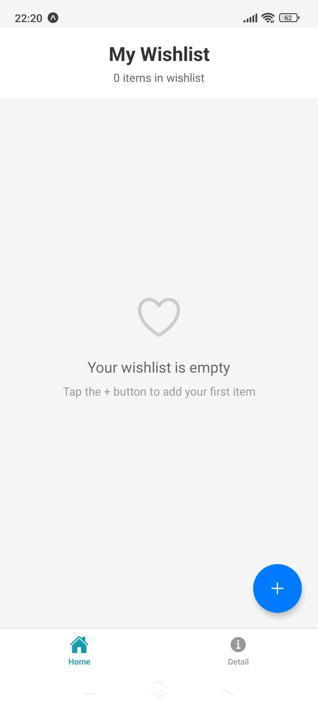
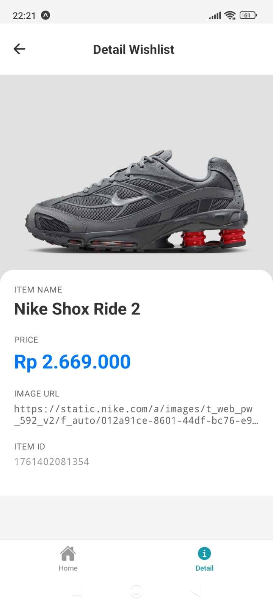
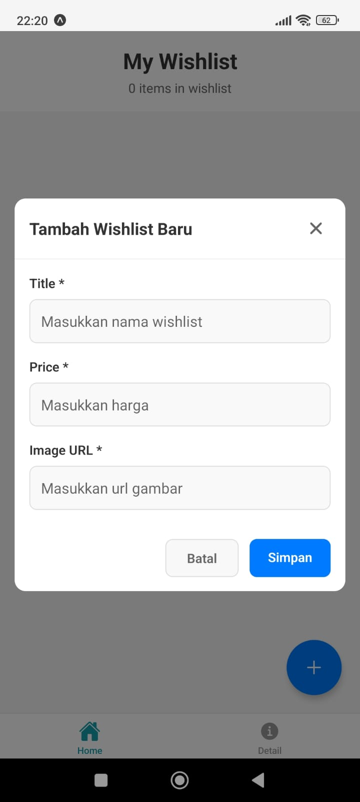
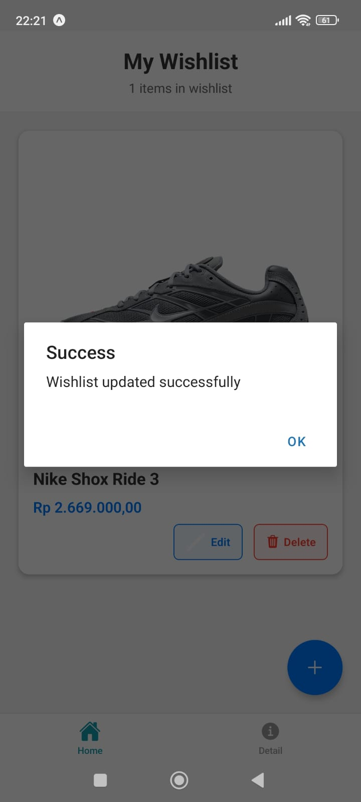
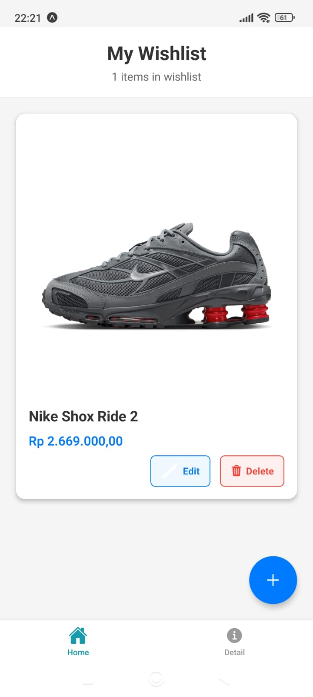
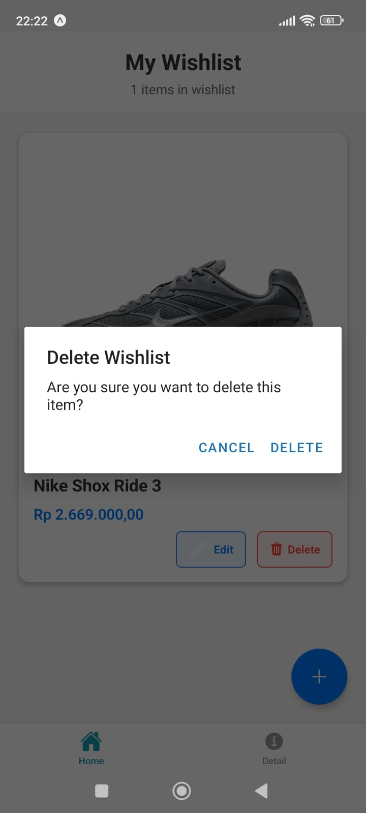
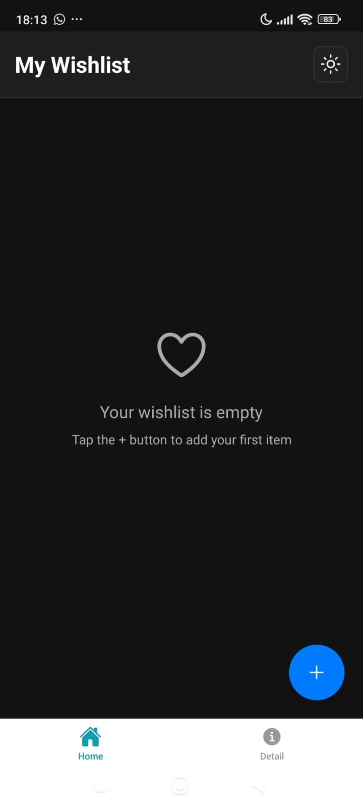
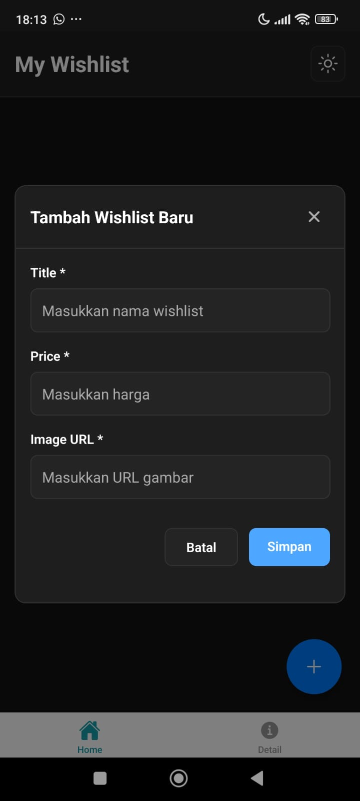
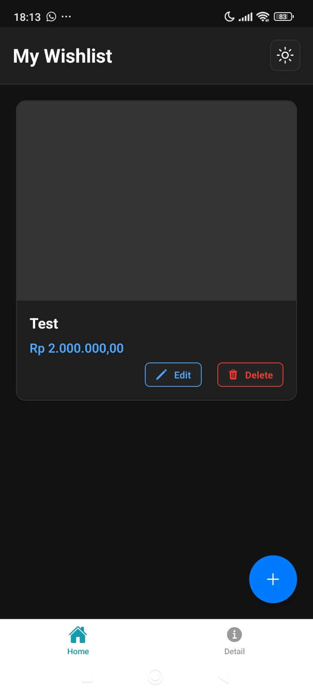
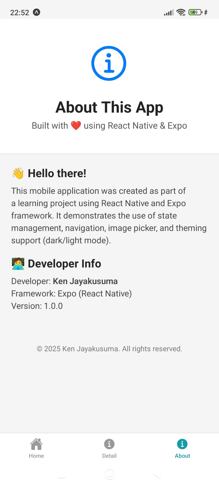

# 🎯 Wishlist Nike - Aplikasi React Native Expo

Aplikasi manajemen wishlist modern yang dibangun dengan React Native, Expo, Zustand untuk state management, dan Supabase sebagai backend database. Sempurna untuk melacak produk Nike favorit atau barang apapun yang ingin Anda beli.

[](https://reactnative.dev/)
[](https://expo.dev/)
[](https://www.typescriptlang.org/)
[](https://zustand-demo.pmnd.rs/)
[](https://supabase.com/)

## 📸 Demo Aplikasi

<div align="center">

  
  
  
  
  
  

  
  
  
  
  

  
  


</div>


## 📱 Fitur

- ✅ **Operasi CRUD Lengkap** - Buat, Baca, Update, dan Hapus item wishlist
- ☁️ **Cloud Database** - Data tersimpan di Supabase (PostgreSQL) dengan sinkronisasi real-time
- 💾 **Offline Support** - Data di-cache lokal menggunakan AsyncStorage
- 🎨 **UI/UX Modern** - Antarmuka yang bersih dan intuitif dengan animasi halus
- 📝 **Validasi Form** - Validasi built-in untuk semua input field
- 🖼️ **Dukungan Gambar** - Tambahkan gambar melalui URL atau dari galeri
- 💰 **Format Harga** - Format mata uang Rupiah Indonesia (IDR)
- 🔍 **Tampilan Detail** - Halaman khusus untuk melihat detail item
- 📱 **Desain Responsif** - Dioptimalkan untuk berbagai ukuran layar
- ⚡ **Cepat & Ringan** - Dibangun dengan fokus pada performa
- 🔄 **State Management** - Manajemen state yang efisien dengan Zustand

## 📁 Struktur Projek

```
wishlist-nike-react-expo/
├── app/
│   ├── (tabs)/
│   │   └── index.tsx          # Halaman utama dengan daftar wishlist
│   ├── detail/
│   │   └── [id].tsx           # Halaman detail untuk setiap item
│   └── _layout.tsx            # Root layout
├── components/
│   ├── Card.tsx               # Komponen card wishlist
│   └── Modal.tsx              # Komponen modal untuk tambah/edit
├── store/
│   └── useWishlistStore.ts    # Zustand store untuk state management
├── assets/                    # Gambar dan file statis
├── app.json                   # Konfigurasi Expo
├── package.json               # Dependencies
└── tsconfig.json              # Konfigurasi TypeScript
```

## 🛠️ Tech Stack

### Teknologi Inti
- **React Native** - Framework aplikasi mobile
- **Expo** - Platform development
- **TypeScript** - JavaScript dengan type-safe
- **Expo Router** - Routing berbasis file

### Backend & Database
- **Supabase** - Backend-as-a-Service (PostgreSQL database)
- **Supabase Client** - Real-time database operations

### State Management & Storage
- **Zustand** - State management yang ringan
- **AsyncStorage** - Penyimpanan lokal persisten (cache)
- **Zustand Persist** - Middleware untuk persistensi state

### Komponen UI & Styling
- **React Native Components** - Elemen UI native
- **Expo Vector Icons** - Library icon
- **React Native Safe Area Context** - Handling safe area

## ⚙️ Setup & Installation

### 1. Clone Repository

```bash
git clone https://github.com/KenJaya270/wishlist-nike-react-expo.git
cd wishlist-nike-react-expo
```

### 2. Install Dependencies

```bash
npm install
```

### 3. Setup Supabase

#### a. Buat Project Supabase

1. Kunjungi [https://supabase.com](https://supabase.com) dan buat akun
2. Buat project baru
3. Tunggu hingga database siap

#### b. Jalankan SQL Schema

1. Buka Supabase Dashboard → SQL Editor
2. Copy isi file `supabase-schema.sql`
3. Paste dan jalankan di SQL Editor
4. Verifikasi tabel `wishlists` sudah terbuat

#### c. Setup Environment Variables

1. Copy file `.env.example` menjadi `.env`:
   ```bash
   cp .env.example .env
   ```

2. Buka Supabase Dashboard → Settings → API
3. Copy **Project URL** dan **anon public key**
4. Paste ke file `.env`:
   ```env
   EXPO_PUBLIC_SUPABASE_URL=https://your-project.supabase.co
   EXPO_PUBLIC_SUPABASE_ANON_KEY=your-anon-key-here
   ```

### 4. Jalankan Aplikasi

```bash
npm start
```

Pilih platform:
- Tekan `a` untuk Android
- Tekan `i` untuk iOS
- Tekan `w` untuk Web

## 📖 Petunjuk Pemakaian

### Menambahkan Item Wishlist

1. Tekan **tombol floating action button (FAB)** dengan ikon plus
2. Isi formulir:
   - **Title**: Nama item (wajib diisi)
   - **Price**: Harga dalam Rupiah (wajib diisi, hanya angka)
   - **Image URL**: Link ke gambar produk (wajib diisi)
3. Tekan **"Simpan"** untuk menyimpan

### Melihat Detail Item

- Ketuk kartu wishlist manapun untuk melihat detail lengkap
- Lihat nama item, harga, gambar, dan ID
- Gunakan tombol back untuk kembali ke daftar

### Mengedit Item

1. Tekan **ikon pensil** pada kartu wishlist
2. Perbarui informasi di modal
3. Tekan **"Update"** untuk menyimpan perubahan

### Menghapus Item

1. Tekan **ikon tempat sampah** pada kartu wishlist
2. Konfirmasi penghapusan di dialog alert
3. Item akan dihapus dari daftar

## 👤 Pengembang

**KenJaya270**
- GitHub: [@KenJaya270](https://github.com/KenJaya270)
- Repository: [wishlist-nike-react-expo](https://github.com/KenJaya270/wishlist-nike-react-expo)

---

Dibuat dengan ❤️ menggunakan React Native dan Expo

⭐ Jangan lupa beri bintang pada repository ini jika bermanfaat!

## 🔗 Deeplinking (Deep Links) ✅

Deep linking memungkinkan aplikasi dibuka langsung ke halaman detail item melalui URL.

- Scheme yang dipakai: `wishlistnike://`
- Contoh deep link ke detail item: `wishlistnike://detail/<item-id>`

Contoh cara membuat deep link programmatically:

```ts
import * as Linking from 'expo-linking';
const url = Linking.createURL('/detail/123'); // https://expo.dev/.. in dev, wishlistnike://detail/123 in production with scheme
```

Contoh untuk membuka URL dari environment (Android):

```bash
npx uri-scheme open wishlistnike://detail/123 --android
```

Contoh untuk membuka URL dari environment (iOS simulator):

```bash
npx uri-scheme open wishlistnike://detail/123 --ios
```

Atau, di aplikasi, gunakan tombol Share pada kartu untuk membagikan deep link item.

## 🌐 Deferred Link

Link ini menggunakan Airbridge untuk mengarahkan pengguna ke aplikasi (atau Store jika belum terinstall):

https://abr.ge/5kgrlwo
